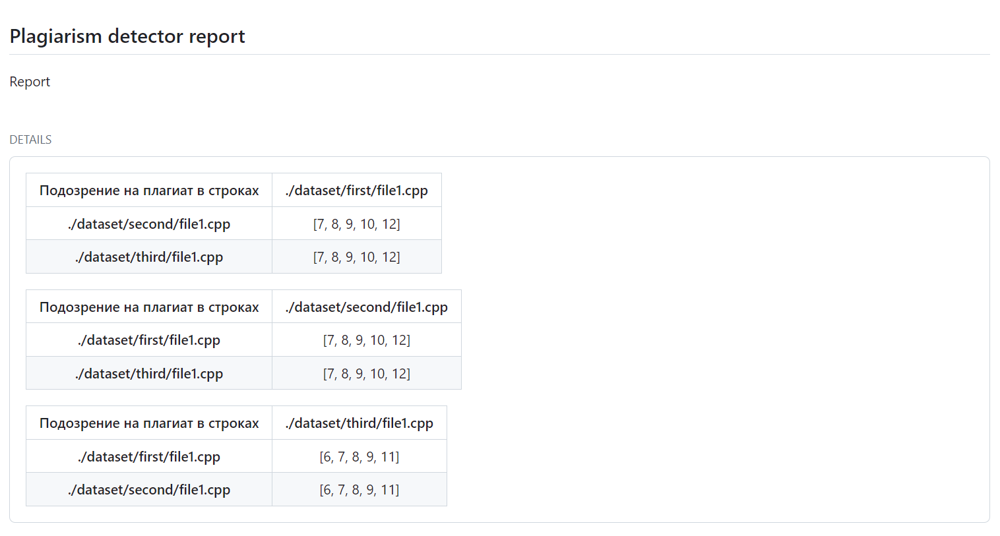

# plagiarism-reporter

Этот [Github Action](https://github.com/features/actions) показывает результаты работы библиотеки plagiarism-detector в виде таблицы.
Как это выглядит 

## Пример:
```yaml
name: 'CI'
on:
  push:
jobs:
  build:
    runs-on: ubuntu-latest
    steps:
      - uses: actions/checkout@v2
      - run: npm install    
      - run: npm run plag-folders         # your name in package.json
      - uses: actions/upload-artifact@v3
        with:
          name: plag-results
          path: plag.json
  plag-reporter:
    name: plagiarism report
    runs-on: ubuntu-latest
    needs: build
    steps:
    - name: Download artifact
      uses: actions/download-artifact@v3
      with: 
        name: plag-results
    - name: Print results
      uses: DmitryAlexandrovv/plagiarism-reporter@master

```
